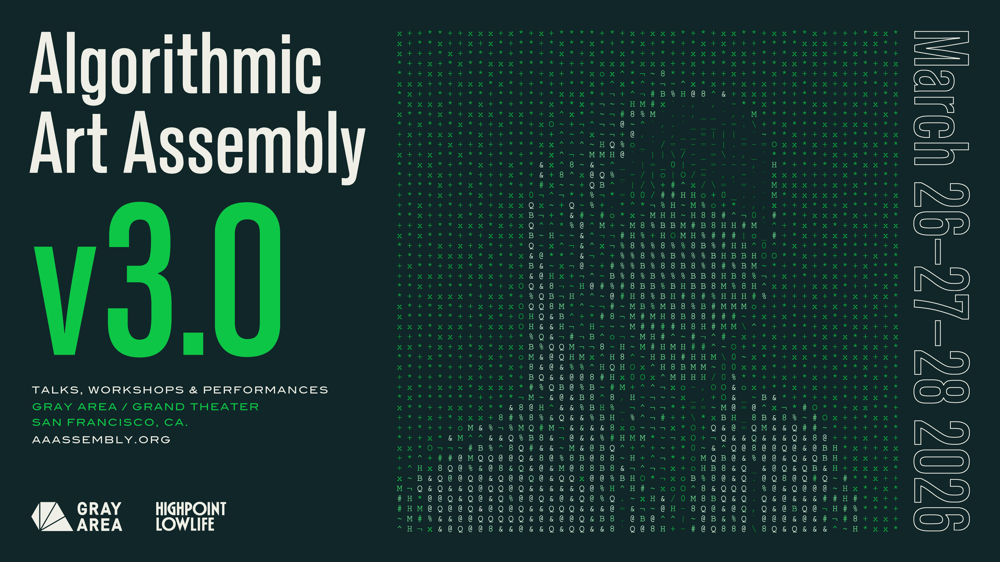

The third [Algorithmic Art Assembly](https://aaassembly.org/)
will be happening in San Francisco March 26-28, 2026.

I'll be performing on the first evening, with
[Sebastian Camens](https://www.sebastiancamens.com/)
on visuals.

Thrilled to be sharing the bill with these fine artists
over three days:

Carl Lostritto,
Catty Dan Zhang,
Char Stiles,
Chia Amisola,
Claire L Evans,
Codie,
c*robo*,
Daniel Temkin,
Deli Kuvveti,
Gábor Lázár,
Kara-Lis Coverdale,
Keith Fullerton Whitman,
Luisa Mei,
Lee Tusman,
Nathan Ho,
nnirror,
R Tyler,
Ruaridh Law,
Sebastian Camens,
Tom Hall,
tsrono,
William Fields,
Wolff Parkinson White

You should go!
