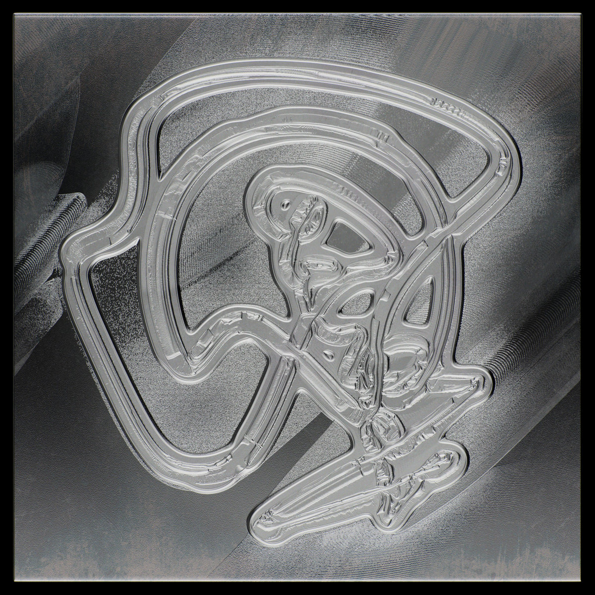
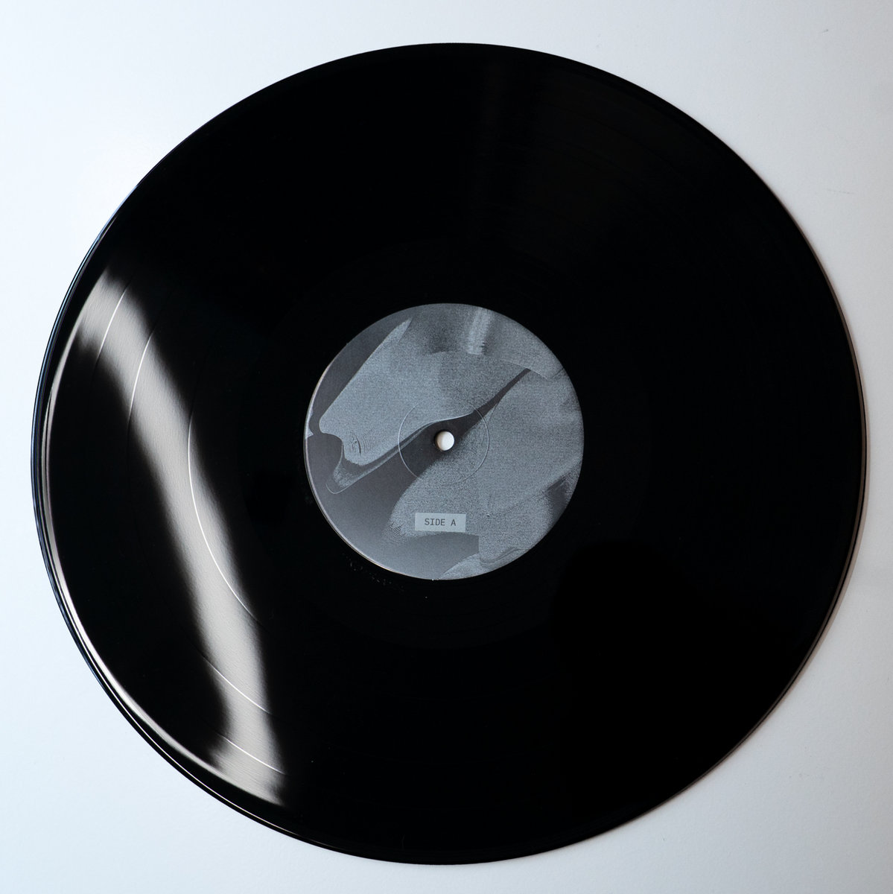

Pleased to announce new music: _[variadic daemon](https://kindohm.bandcamp.com/album/variadic-daemon)_, available
both on vinyl and digital. Free download is available at
[kindohm.com](https://kindohm.com).

  
  

<aside>
Conceived, composed, produced and recorded March-May 2025 in a basement in Chaska, Minnesota, USA.

All sequencing: TidalCycles

released January 8, 2026

Produced by Mike Hodnick

Mastered by Angel Marcloid at Angel Hair Audio

Design by Sebastian Camens

</aside>
